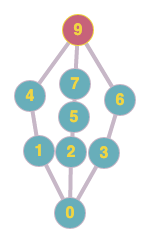

# Lem_in
Lem-in is an algorithmic project, in which the main idea is to distribute ants from the start position to the end without traffic jams using unweighted bidirectional graph. If you want more details - check the attached pdf.

## Running
```
make
./lem-in < file or input
```

## Input

1. First line contain amount of ants to distribute
2. Nodes
3. Links

```
Node Format:
NAME N1 N2
NAME - name of location without '-' and whitespace symbols
N1, N2 - two numbers.

Links Format:
NAME1-NAME2
NAME1, NAME2 - Two names that are given in nodes

Comment Format:
#MESSAGE
Line that start with '#' is ignored

Commands:
##start - next line after is ants start point
##end - next line after is ants end point
##fileoff - do not print input
##turns - print how much turns is needed to distribute ants
```

Example input:



0 is the start location, 9 is the end location.
```
#comment
2
#comment
##start
#comment
startNode 1 1
left 1 2
middle 2 1
right 2 2
left1 1 3
#comment
middle1 3 1
right1 3 3
middle2 4 1
##end
endNode 4 4
startNode-left
startNode-middle
startNode-right
#comment
left-left1
right-right1
middle-middle1
middle1-middle2
endNode-left1
endNode-right1
endNode-middle2
##fileoff
##turns
##comment, no such command
```

# Output:
1. Your input(#fileoff is off this part)
2. Answer

```
Answer format:
LN-ROOM
LN - N is sequence number of ants
ROOM - is room that ant is going.

```

Example output:
```
L1-right L2-left
L1-right1 L2-left1
L1-endNode L2-endNode
Turns : 3
```
